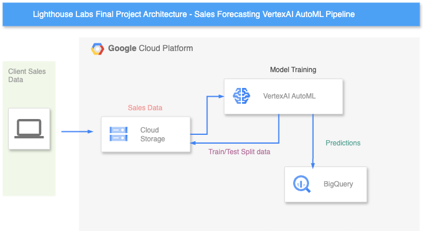

Below is the updated `README.md` content based on your provided structure, with an additional section for running the Streamlit app:

---

# 🌟 AutoML Hierarchical Forecasting with Vertex AI 🌟

Welcome to the **AutoML Hierarchical Forecasting** project! This repository houses a comprehensive journey from data exploration to model deployment, using Google Cloud's Vertex AI to harness the power of machine learning. Whether you're a data enthusiast or a seasoned data scientist, this project provides valuable insights into building and deploying forecasting models at scale.

## Architecture


## 🗂️ Project Structure

```plaintext
vertexai-automl-forecasting-lhl/
│
├── data/
│   ├── raw/                      # Raw synthetic sales data
│   │   └── synthetic_sales_data.csv
│   ├── test/                     # Test dataset for model evaluation
│   │   └── sales_forecasting_test.csv
│   └── train/                    # Training dataset for model building
│       └── sales_forecasting_train.csv
│
├── images/                       # Visuals and plots generated during the project
│   ├── batch_prediction_screenshot.png
│   ├── model_eval_results_gcp.png
│   ├── prediction_vs_ground_truth.png
│   ├── rel_plot.png
│   └── upload_train_data_gcs.png
│
├── notebooks/                    # Jupyter notebooks guiding each project stage
│   ├── EDA.ipynb                 # Exploratory Data Analysis
│   ├── GoogleCloudEnvSetup.ipynb # Google Cloud environment setup
│   ├── model_development_and_prediction.ipynb  # Model development and deployment
│   └── results_dataset.ipynb     # Prediction results analysis
│
├── lhl-demo-streamlit.py         # Streamlit app to demo the project
├── dataset.csv                   # Consolidated dataset for final analysis
├── README.md                     # You're reading it right now!
└── requirements.txt              # Python dependencies for the project
```

## 🎯 Project Objectives

This project aims to accomplish the following key tasks:

1. **Data Preparation**:
   - Transform synthetic sales data into a format suitable for hierarchical forecasting.
   
2. **Exploratory Data Analysis (EDA)**:
   - Dive deep into the data to identify patterns, trends, and anomalies that will inform the model-building process.
   
3. **Model Development**:
   - Leverage Vertex AI AutoML to construct a robust hierarchical forecasting model using regression.
   - Train the model on curated sales data to predict future trends with precision.
   
4. **Deployment and Batch Prediction**:
   - Seamlessly deploy the trained model using the Vertex AI SDK for Python.
   - Perform batch predictions on new data and assess the model's performance.

5. **Results Analysis**:
   - Visualize and evaluate the model's predictions to ensure accuracy and reliability.

## 📊 Key Findings from EDA

The EDA process revealed several crucial insights about the sales data:

- **Seasonality**: Both `Snow` and `Water` product categories exhibited strong seasonal patterns, with sales peaking during their respective high-demand periods (e.g., winter for Snow products).
- **Sales Distribution**: The `sales` feature was right-skewed, indicating that lower sales values were more frequent, with a few high-sales instances acting as outliers.
- **Store Impact**: The `store_index` feature showed a strong negative correlation with `sales`, suggesting that certain stores consistently underperformed compared to others.
- **Product-Specific Trends**: Some products consistently outperformed others, highlighting the importance of product-specific strategies.
- **Correlation Analysis**: The `day_of_week` feature had a weak positive correlation with `sales`, indicating minor variations in sales depending on the day.

## 📈 Model Results from Vertex AI

The Vertex AI model provided the following key results:

- **Machine Learning Method**: The project utilizes **regression** within Vertex AI AutoML to solve the sales forecasting use case. Regression is well-suited for predicting continuous numerical values, making it ideal for forecasting future sales.
- **Trend and Seasonality Capture**: The model effectively captured the overall trend and seasonal patterns in the sales data, providing accurate predictions aligned with the cyclical nature of the data.
- **Prediction vs. Ground Truth**: The model's predictions closely followed the actual sales data, with minor discrepancies in magnitude. Certain products and store locations showed more significant differences, suggesting areas for model refinement.
- **Scalability**: The model demonstrated strong scalability, efficiently handling batch predictions across different product categories and store locations.

### Further Improvements:

- **Model Fine-Tuning**: Further refinement through hyperparameter tuning and feature engineering is recommended to improve accuracy, particularly in areas where the model slightly overestimated or underestimated sales.
- **Granular Modeling**: Considering separate models or more detailed features for different product categories and store locations could reduce prediction discrepancies.

## 🚀 Getting Started

### Prerequisites

Before diving in, ensure you have the following:

- Python 3.7+
- Google Cloud SDK
- Vertex AI SDK for Python
- Jupyter Notebook

### Setup Instructions

1. **Clone the Repository**:
   ```bash
   git clone https://github.com/yourusername/lhl-final-project.git
   cd lhl-final-project
   ```

2. **Google Cloud Setup**:
   - Follow the step-by-step instructions in `GoogleCloudEnvSetup.ipynb` to authenticate your environment and enable the necessary APIs.

3. **Install Dependencies**:
   ```bash
   pip install -r requirements.txt
   ```

4. **Run the Notebooks**:
   
   - Start with `GoogleCloudEnvSetup.ipynb` for environment setup
   - Then proceed to `EDA.ipynb` to explore the data.
   - Proceed to and finish with `model_development_and_prediction.ipynb` for model building, deployment and to analyze the forecasted results.

### Running the Streamlit App

To visualize and interact with the project's findings, run the Streamlit app as follows:

1. **Install Streamlit** (if not already installed):
   ```bash
   pip install streamlit
   ```

2. **Run the Streamlit App**:
   ```bash
   streamlit run lhl-demo-streamlit.py
   ```

3. **Explore the App**:
   - **Introduction**: Overview of the project and problem statement.
   - **Exploratory Data Analysis (EDA)**: Visualizations and insights from the EDA process.
   - **Model Training in Vertex AI**: Details about the model training process and key configuration settings.
   - **Model Results**: Evaluation of the model's performance, including prediction accuracy and feature importance.
   - **Batch Predictions**: Analysis of batch predictions compared to actual sales data.

## 📊 Results & Insights

Explore the `images/` directory to find visual representations of the model's performance. Detailed analyses and evaluation metrics are documented in the `model_development_and_prediction.ipynb` notebook. Key highlights include:

- **Prediction vs. Ground Truth**: See how the model's forecasts align with actual data.
- **Batch Predictions**: Visual snapshots of the batch prediction process, showcasing the model's scalability.

## 🤝 Contributing

We welcome contributions! If you have suggestions or improvements, feel free to open an issue or submit a pull request. Let's build something great together.


---

Thank you for exploring this project. We hope it serves as a valuable resource on your machine learning journey. Happy forecasting! 📈

--- 
